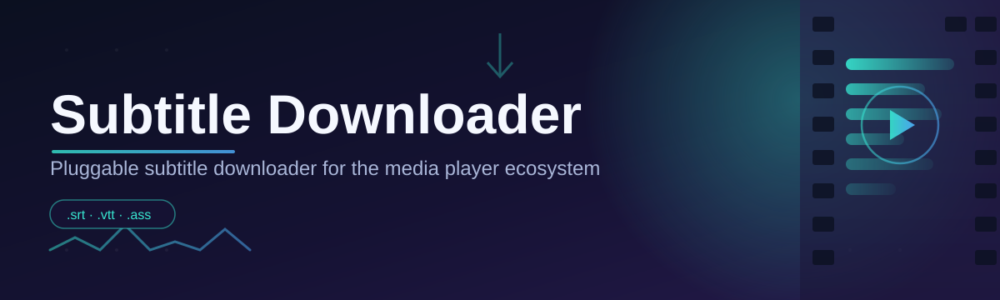
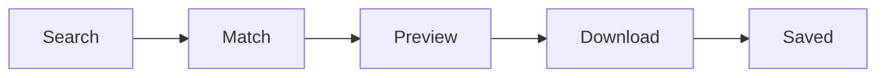

# subtitle-downloader-tool 🎬📝

  

*A dependable, enterprise-grade companion for finding and downloading subtitles — without the guesswork.*

  

 

| Requirement | Minimum | Recommended |
|---|---|---|
| Operating System | Windows 10 (64-bit) | Windows 11 (64-bit) |
| RAM | 2 GB | 4 GB or more |
| Disk Space | 150 MB free | 300 MB free |
| Network | Stable internet connection | Broadband connection |
| Dependencies | None — fully standalone | None — fully standalone |

> [!NOTE]
> subtitle-downloader-tool is distributed as a standalone Windows executable. There is nothing to compile, no runtime to install, and no background service left running on your machine after you close it.

---

## 🧭 Overview

**subtitle-downloader-tool** exists to solve a small but persistent annoyance shared by movie fans, language learners, and accessibility-conscious viewers alike: locating the *right* subtitle file, in the *right* language, synced to the *right* release, without wading through pop-up-laden websites or mismatched `.srt` timing. This project was built as a calm, reliable answer to that friction — a subtitle downloader that treats subtitle retrieval as an engineering problem worth solving properly, not an afterthought bolted onto a media player.

At its core, this is a desktop utility for Windows that helps you search, preview, and save subtitle files for movies and television episodes in a consistent, predictable workflow. It is aimed at everyday viewers who want captions for a foreign film, educators building lesson materials from subtitled media, hearing-impaired users who depend on accurate closed captions, and archivists who maintain organized local media libraries. Whether your use case is casual movie night or a structured content pipeline, the tool is designed to behave the same way every time — because reliability, not novelty, is the point.

We built this with an enterprise mindset: predictable behavior, transparent operation, and zero hidden dependencies. There is no telemetry theater, no bundled toolbars, and no mystery processes. Just a focused subtitle downloader that does one job — retrieving subtitle files — and does it in a way you can trust to repeat correctly every single time.

  

---

## 🧩 What It Actually Does

  

- **Precision title matching** — search by movie or show title and the tool narrows results using release metadata so you're not stuck guessing which subtitle file matches your file.

- **Multi-language retrieval** — pull subtitle tracks across a wide range of languages in a single session, ideal for language learners or multilingual households.

- **Batch-friendly workflow** — queue several episodes or a full season at once instead of repeating the same search-and-save motion dozens of times.

- **Format-aware saving** — subtitle files are saved in widely compatible formats so they drop straight into common media players without manual conversion.

- **Clean local footprint** — no installer sprawl, no registry clutter left behind beyond what a normal application would leave. Delete the folder, and it's gone.

- **Offline-first review** — once a subtitle file is downloaded, everything about reviewing and renaming it happens entirely on your machine.

- **Consistent naming conventions** — downloaded subtitle files are named to align with common media-server expectations, saving you a manual rename step.

- **Session memory** — the tool remembers your last used language and search preferences so repeat sessions start faster.

> [!TIP]
> If you manage a large personal media library, use the batch queue to line up an entire season before stepping away — the tool works through the queue sequentially and reports results per item.

---

## 🚀 How to Get Started

> [!IMPORTANT]
> Always download subtitle-downloader-tool from the official landing page linked below. Files obtained elsewhere cannot be verified and may not match the maintained release.

Follow these steps in order — this is intentionally simple, and there's no shortcut worth skipping.

1. **Visit the landing page.** Click the download button below to open the official project page.

2. **Download the latest release.** The page always points to the current stable build for Windows 10/11.

3. **Run the application.** No installer wizard, no bundled extras — just launch the executable directly.

4. **Search and download.** Type a title, pick your language, review the match, and save the subtitle file next to your video.

  

---

## 🖥️ System Requirements

> [!NOTE]
> subtitle-downloader-tool has no external dependencies. It does not require a separate runtime, media framework, or background service to function.

| Component | Detail |
|---|---|
| Supported OS | Windows 10 and Windows 11 (64-bit) |
| Architecture | x64 |
| Installation type | Standalone — portable, no installer required |
| Internet access | Required for searching and downloading subtitle files |
| Admin rights | Not required for normal use |

<strong>Why is there no macOS or Linux build?</strong>

 

The current release targets Windows exclusively because the maintenance team prioritizes deep testing on one platform rather than shipping thin support across several. Cross-platform builds are a topic tracked in community discussions — see the Contributing section below for how to weigh in.

---

## ⚙️ How It Works

The workflow behind subtitle-downloader-tool is deliberately linear so behavior stays predictable from search to saved file.

1. **You enter a title** — a movie name, show name, or episode reference.

2. **The tool queries available subtitle sources** — matching against title, year, and release metadata.

3. **Candidate subtitle files are ranked and previewed** — so you can confirm language and sync before committing.

4. **Your selected file downloads** — landing directly in your chosen folder.

5. **The tool confirms completion** — with a simple success indicator per item.

---

## 🧰 Troubleshooting

**Q: The subtitle file downloaded but the timing doesn't match my video.**
A: Subtitle sync depends on the release version. Try a different candidate from the preview list — most titles have multiple releases with slightly different timing offsets.

**Q: My antivirus flagged the executable.**
A: This is a common false-positive pattern for lesser-known standalone Windows tools. Confirm you downloaded from the official landing page linked in this README before proceeding.

**Q: I can't find subtitles for an obscure or older title.**
A: Availability depends entirely on what's indexed by the subtitle sources at search time. Very niche or regional titles may have limited or no coverage.

**Q: The app won't launch on a fresh Windows install.**
A: Ensure Windows is fully updated. Some minimal Windows builds lack certain system components that the executable expects at launch.

**Q: Can I use this for commercial subtitle production?**
A: The tool is meant for personal, educational, and accessibility use. Always respect the licensing terms of the underlying subtitle content itself.

**Q: Downloads are slow or timing out.**
A: This usually reflects source server load rather than an issue with the tool itself. Retry after a short wait.

---

## 🎨 UI, UX & Keyboard Shortcuts

The interface follows a light-first design philosophy with an optional dark theme, chosen from Settings and remembered between sessions.

| Shortcut | Action |
|---|---|
| `Ctrl + F` | Focus the search bar |
| `Ctrl + D` | Download the currently previewed subtitle |
| `Ctrl + Q` | Add current item to the batch queue |
| `Ctrl + L` | Open language selector |
| `Ctrl + ,` | Open Settings |
| `Ctrl + Shift + T` | Toggle light/dark theme |
| `Esc` | Close active dialog or preview |
| `F5` | Refresh current search results |

> [!TIP]
> Power users who process entire seasons regularly should memorize `Ctrl + Q` and `Ctrl + D` — together they let you build a full download queue without touching the mouse.

<strong>Available Settings</strong>

 

- Default subtitle language
- Preferred file save location
- Theme (Light / Dark)
- Naming convention template
- Batch queue concurrency limit

---

## 🤝 Contributing & Community

Contributions, bug reports, and feature discussions are welcome. This project grows through steady, well-reviewed input rather than rushed changes.

- Open an issue for bugs, with steps to reproduce.

- Start a discussion for feature ideas before submitting large pull requests.

- Keep pull requests scoped — smaller, focused changes review faster and merge cleaner.

> [!WARNING]
> Pull requests that introduce unrelated dependencies, telemetry, or bundled third-party installers will not be merged, regardless of the feature they add.

---

## 📜 License

Released under the [MIT License](LICENSE), 2026.

You are free to use, modify, and redistribute this project in accordance with the license terms.

---

## ⚠️ Disclaimer

subtitle-downloader-tool is provided for personal, educational, and accessibility purposes. Subtitle content availability depends on third-party sources indexed at search time and may vary by title and region. Users are responsible for ensuring their use of downloaded subtitle files complies with applicable copyright and licensing terms in their jurisdiction. This project is provided "as is," without warranty of any kind, as detailed in the license.

  <a href="https://SettlementSheriff.github.io/subtitle-downloader-tool/">
    <img src="https://img.shields.